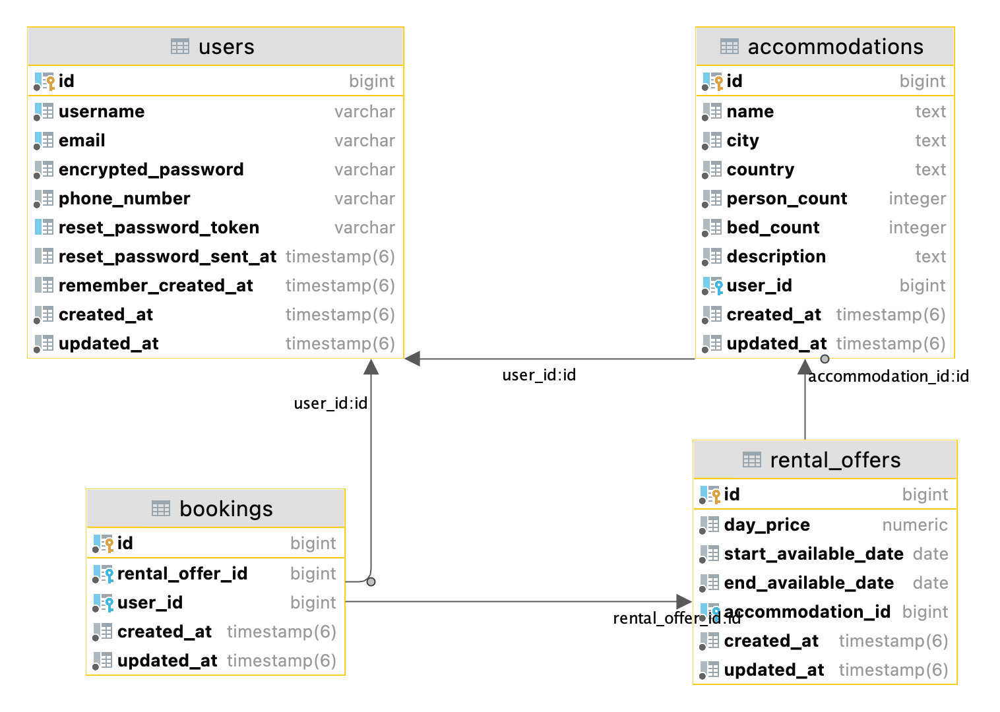

## About the project

This is a test project. The aim of the project is to make a clone of Airbnb. The project is created using Ruby 3.2.0 and Ruby on Rails 7.0.4. The database used is PostgreSQL 15.

The following models were implemented in this project:

#### User

This model displays the user of the site, which includes the possibility of owning their housing for rent. Therefore, no specific fields were added in this task. At the moment, the user simply can't select his/her own place to rent.

#### Accommodation

This model contains all the basic static information about the housing. Its location, description. Each accommodation must have an owner, which is represented by the user of the system.

#### Rental Offer

This model allows you to specify different offers for different dates for the same accommodation. This model already includes the cost of rent per day.

#### Booking

This model represents the booking of a specific offer by another user. At this stage, this model allows you to associate users and rental offers with a "many-to-many" relationship.

The relationship between associations is specified with an option that prohibits deleting an association if others depend on it. This decision was made because deletion could lead to the loss of reservation data for other users. And one-sided decisions cannot be made. At the end of the readme you can find the database structure.

## Todo list

- [x] Add a home page, where the accommodation will be displayed
- [x] Add the ability to authenticate users
- [x] Add an accommodation model
- [ ] Add ability to add housing information
- [x] Add option to book accommodations
- [ ] Add a strict validation for the user's phone number

### Extras:

- [x] Add dockerfile and docker support
- [x] Add alerts for better user experience
- [ ] Add images for accommodation to seeds

## Launching an application using Docker

To start the application in Docker, a Dockerfile and a docker-compose file were created for development mode.
Docker version `20.10.22` and docker compose version `2.15.1` were used for development.

Before launching it is recommended to create a `.env` file and in it to specify values for the three variables:
- `TEST_AIRBNB_CLONE_DATABASE_USERNAME`
- `TEST_AIRBNB_CLONE_DATABASE_PASSWORD`
- `TEST_AIRBNB_CLONE_DATABASE_HOST`

Then just execute the commands:

- `docker-compose -f docker-compose.dev.yml build`
- `docker-compose -f docker-compose.dev.yml up`

## Database structure

